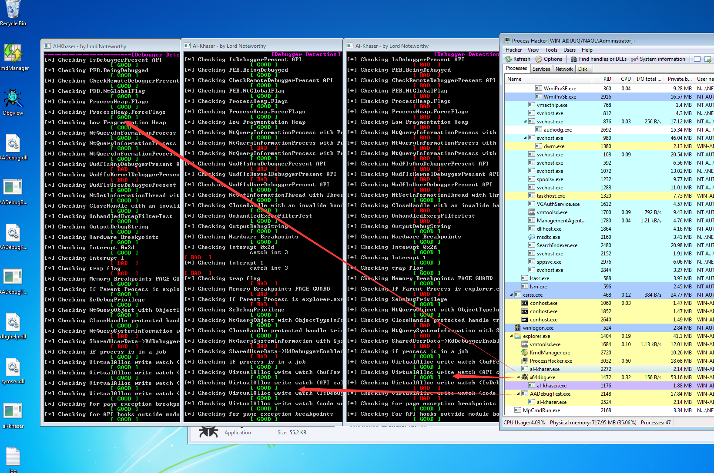
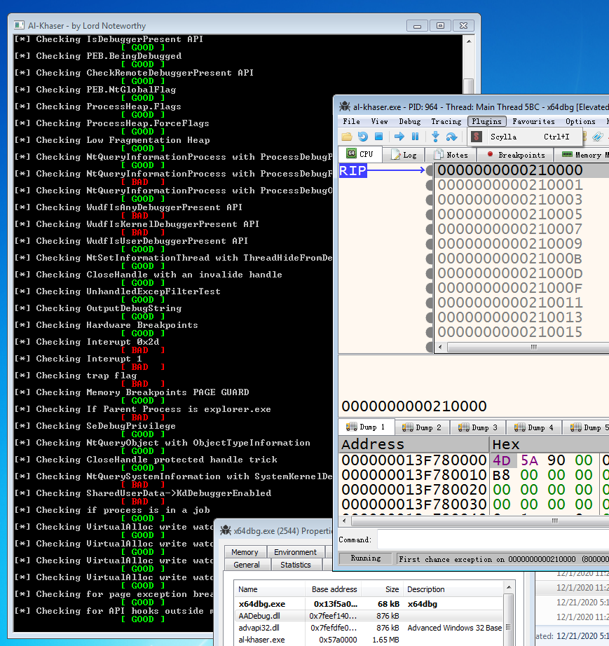

# AADebug

内核反反调试插件
Kernel Anit Anit Debug Plugins

## Language

[English](README-en.md)

When debugging begins, a kernel object called “debug object” is created

调试开始时，将创建一个称为“调试对象”的内核对象

通过重写

NtDebugActiveProcess 
DbgkpQueueMessage 
KiDispatchException
DebugActiveProcess
DbgUixxx

等函数绕过调试对象(Process->DebugObject)以及其他关键位置实现反反调试效果

#### 目前已实现

- 内核绕过DebugPort

- 应用层绕过DbgUiDebugObjectHandle (NtCurrentTeb()->DbgSsReserved[1])

- 应用层绕过PEB->BeingDebugged

- 支持创建进程和附加进程

- ....

##### BUG

- ##### 部分函数还没弄......

#### 未来准备支持(按优先级排序)

- (已完成)支持[x64dbg](https://github.com/x64dbg/x64dbg "x64dbg") 

- (已完成 待测试)支持[cheat-engine](https://github.com/cheat-engine/cheat-engine "cheat-engine")

- (已完成 有些是内核工程太大 不如在应用层做处理  内核做的话得不偿失)绕过大部分[al-khaser](https://github.com/LordNoteworthy/al-khaser "al-khaser")应用层反调试手段

- 支持虚拟机双机调试 重写内核调试函数 绕过内核反调试检测

- 虚拟机双机调试支持[VirtualKD](https://github.com/sysprogs/VirtualKD)

- 支持Win10

- 绕过部分游戏反调试保护(HS BE TP ...)

- 绕过VMP SE等反调试加壳

## Screenshot(2020-12-20)
从左到右依次为 
- 未启用内核模式 虚拟机正常运行al-khaser
- AADebugTest启动al-khaser
- x64dbg无插件模式下启动al-khaser
<h1 align="center">
	
	 
	 
</h1>

## Screenshot(2020-12-21)
<h1 align="center">
	
	 
	 
</h1>

## Reference

https://github.com/MeeSong/KTL 启用内核STL

https://github.com/MeeSong/TrialSword (private project) 参考了不少该项目代码

https://github.com/matt-wu 部分代码被我放在了该项目中 不过那部分代码已经从公开库中删除

# Build

#### 反反调试插件比较特殊 为了避免一些不必要的麻烦 删除了部分代码(仅删除了不到5%

#### 填补完成方式如下:

- ##### 需要自己添加内核钩子库对接NewFunc.cc中的Init 需要注意CPU以及线程同步问题 在x64上还需要注意14字节长度的问题

- ##### 反内核调试检测需要自己填补NewKiDispatchException中的Kernel部分代码 以及内核调试流程下的全部函数

- ##### 补全应用层符号获取并上传

- ##### 其他

- ##### 补充:某些游戏或反调试程序就喜欢搞异常测试 这种情况下在内核中直接放过 不要理他 跳过该异常 目标就无法检测调试状态了 至于真异常 那是程序本身的问题 你指望我能帮你干什么? 跟反反调试无关

### 完整代码或二进制文件获取方式:

申请加群 ()

注:应群成员要求 不再接受任何人加入该小群 

#### JAVA交流群(大群-只闲聊)

546110133
