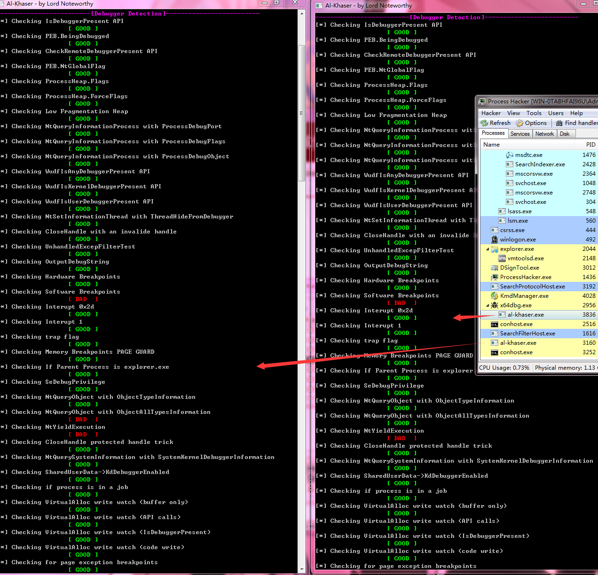
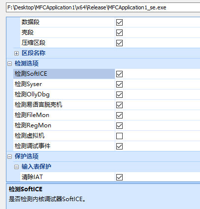
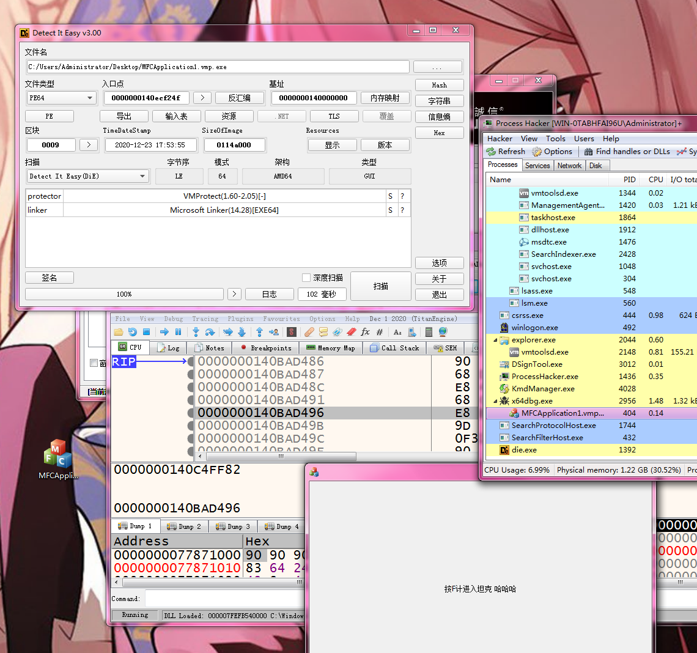
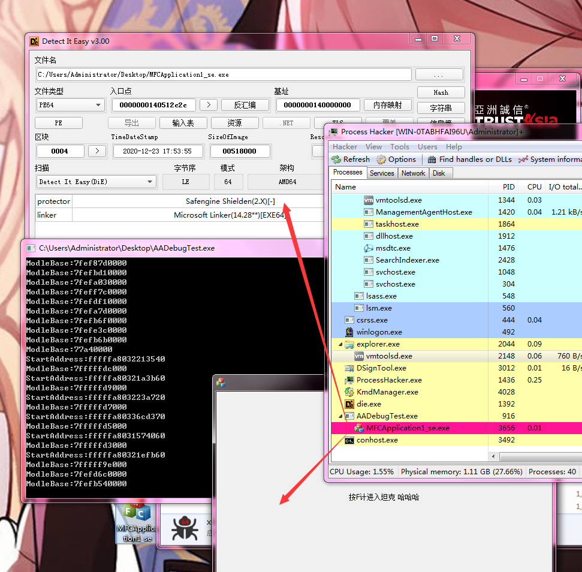
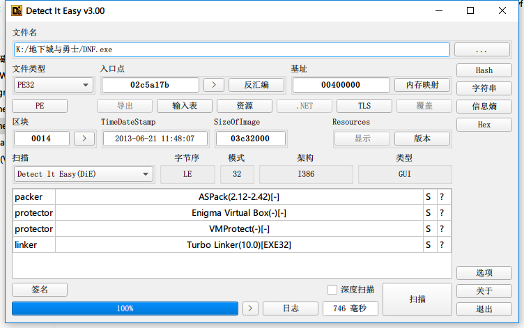
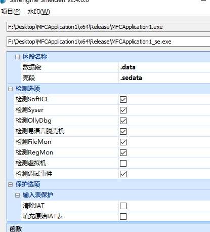

# AADebug

内核反反调试插件
Kernel Anit-Anit-Debug Plugins

## Language

English(Translation from https://github.com/finch7)

## When debugging begins, a kernel object called “debug object” will be created

## 调试开始时，将创建一个称为“调试对象”的内核对象

通过重写
By rewrite

NtDebugActiveProcess 
DbgkpQueueMessage 
KiDispatchException
DebugActiveProcess
DbgUixxx

等函数绕过调试对象(Process->DebugObject)以及其他关键位置实现反反调试效果
such functions to bypass debugging object (Process->DebugObject)and other key locations to achiece anti-anti-debugging effects

#### 目前已实现
#### Currently implemented

- 内核绕过DebugPort
- Kernel bypss DebugPort

- 应用层绕过DbgUiDebugObjectHandle (NtCurrentTeb()->DbgSsReserved[1])
- R3 bypass DbgUiDebugObjectHandle (NtCurrentTeb()->DbgSsReserved[1])

- 应用层绕过PEB->BeingDebugged
- R3 bypass PEB->BeingDebugged

- 支持创建进程和附加进程
- Support creation process and attacth process

- 支持配合ScyllaHide插件同时使用
- Support simultaneous use with ScyllaHide plugin

- 支持[x64dbg](https://github.com/x64dbg/x64dbg "x64dbg") 
- Support [x64dbg](https://github.com/x64dbg/x64dbg "x64dbg") 

- 绕过VMP SE等反调试加壳
- Bypass VMP SE and other anti-debug packers

- 支持wow64
- Support wow64

- ....

##### BUG

- ##### 部分函数还没弄......

- 不支持32位系统
- Does not support 32-bit systems

- 未知
- Unknow

#### 未来准备支持(按优先级排序)
#### Future support (in order of priority)

- (已完成 待测试)支持[cheat-engine](https://github.com/cheat-engine/cheat-engine "cheat-engine")
- (Completed to be tested) Support [cheat-engine](https://github.com/cheat-engine/cheat-engine "cheat-engine")

- (已完成 有些是内核工程太大 不如在应用层做处理  内核做的话得不偿失)绕过大部分[al-khaser](https://github.com/LordNoteworthy/al-khaser "al-khaser")应用层反调试手段
-
(Completed, some of the kernel projects are too big, it is better to do processing at the application layer, if the kernel does it, the gain is not worth the loss) bypass most [al-khaser](https://github.com/LordNoteworthy/al-khaser "al-khaser") Application layer anti-debugging methods

- 支持虚拟机双机调试 重写内核调试函数 绕过内核反调试检测
- Support virtual machine dual-machine debugging, rewrite kernel debugging function, bypass kernel anti-debugging detection

- 虚拟机双机调试支持[VirtualKD](https://github.com/sysprogs/VirtualKD)
-Virtual machine dual-machine debugging support [VirtualKD](https://github.com/sysprogs/VirtualKD)

- 支持Win10
- Support Win10

- 绕过部分游戏反调试保护(HS BE TP ...)
- Bypass some game anti-debugging protection(HS BE TP ...)

### Screenshot(2020-12-20)
从左到右依次为 
From left to right

- 未启用内核模式 虚拟机正常运行al-khaser
- Kernel mode is not enabled The virtual machine is running al-khaser

- AADebugTest启动al-khaser
- AADebugTest start al-khaser

- x64dbg无插件模式下启动al-khaser
- Start al-khaser in x64dbg plug-in mode

<h1 align="center">
	
	 
	 
</h1>

### Screenshot(2020-12-21)
<h1 align="center">
	
	 
	 
</h1>

### Screenshot(2020-12-23)
从左到右依次为 
From left to right
- 虚拟机正常运行al-khaser
- The virtual machine is running al-khaser normally

- x64dbg AADebug插件+ScyllaHide插件 启动al-khaser
- x64dbg AADebug plug-in + ScyllaHide plug-in Start al-khaser

<h1 align="center">
	
	 
	 
</h1>

<h1 align="center">
	
	 
	 
</h1>

<h1 align="center">
	
	 
	 
</h1>

<h1 align="center">
	
	 
	 
</h1>

### Screenshot(2020-12-27)
<h1 align="center">
	
	 
	 
</h1>

<h1 align="center">
	
	 
	 
</h1>

## Reference

https://github.com/MeeSong/KTL 启用内核STL 
Enable kernel STL

https://github.com/MeeSong/TrialSword (private project) 参考了不少该项目代码

https://github.com/matt-wu 部分代码被我放在了该项目中 不过那部分代码已经从公开库中删除

I put part of the code in the project, but that part of the code has been deleted from the public library

# Build

#### 为了避免一些不必要的麻烦 删除了内核钩子库部分代码 剩余部分已经补全
#### The anti-anti-debugging plug-in is special. In order to avoid some unnecessary troubles, some codes have been deleted (only less than 1% have been deleted

### 内核交流小群(780705352)

注:仅供windows内核技术交流 邀请制或审核制入群 
申请加群后 我会添加好友 麻烦各位通过好友请求并耐心等待审核

